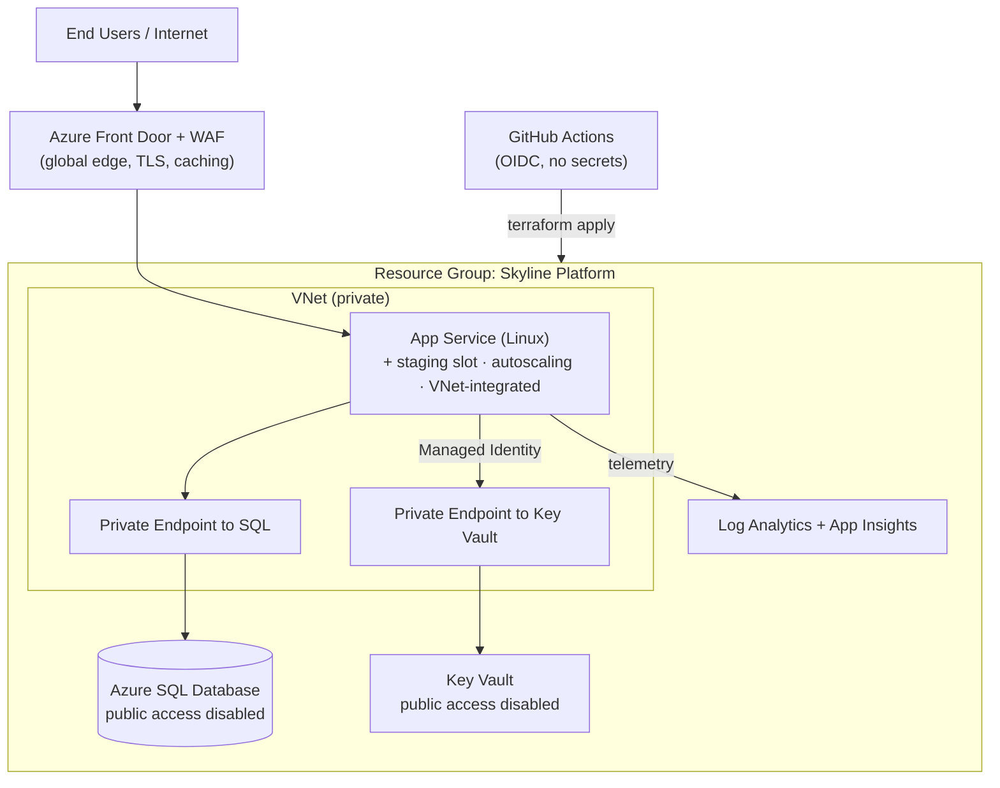

# Skyline Platform — Azure Cloud Engineering Portfolio

A hands-on, production-style Azure platform built entirely with **Infrastructure as Code (Terraform)**, developed as a progressive 5-part lab series. Each part solves a realistic business problem the way a cloud engineering team would in production — with version-controlled infrastructure, secure-by-default design, automation, and observability.

> **Current status:** ✅ Lab 01-02 complete · Labs 03–05 in progress

---

## Why this project exists

This repository documents my transition into cloud engineering by building a real Azure platform from the ground up. The emphasis is not just on *what* was deployed, but on **the engineering decisions and trade-offs behind each choice** — documented as Architecture Decision Records (ADRs) and per-lab write-ups.

The scenario: a fictional SaaS company, **Skyline**, with no governance and infrastructure built by clicking around the Portal. The labs take it to a secure, automated, observable production platform — one capability per "sprint."

---

## Target Architecture (end state, Labs 1–5)



---

## Lab Series

| Lab | Focus | Status | Key Azure Services |
|-----|-------|--------|--------------------|
| **[01 — Foundation](docs/lab-01-foundation.md)** | IaC bootstrap, remote state, governance | ✅ Complete | Storage, Resource Groups, Azure Policy, Entra ID / RBAC |
| **[02 — Web Platform](docs/lab-02-web-app.md)** | App hosting + managed DB + secrets | ✅ Complete | App Service, Azure SQL, Key Vault, Managed Identity |
| **03 — Secure Networking** | Private connectivity, no public data tier | ⬜ Planned | VNet, Private Endpoints, Private DNS, NSGs |
| **04 — CI/CD** | Secretless automated deployments | ⬜ Planned | GitHub Actions, Entra Workload Identity (OIDC) |
| **05 — Observability & Scale** | Monitoring, autoscale, edge security | ⬜ Planned | Log Analytics, App Insights, Autoscale, Front Door + WAF |

---

## Architecture Decision Records

Significant design decisions are documented as ADRs:

- [ADR-0001 — Remote state in Azure Storage](docs/adr/0001-remote-state-in-azure-storage.md)
- [ADR-0002 — Entra ID / RBAC auth over shared storage keys](docs/adr/0002-rbac-over-storage-keys.md)
- [ADR-0003 — Imperative bootstrap for the state backend](docs/adr/0003-imperative-bootstrap.md)
- [ADR-0004 — App Service (PaaS) over containers or VMs](docs/adr/0004-app-service-over-containers.md)
- [ADR-0005 — Managed identity + Key Vault references over secrets in config](docs/adr/0005-managed-identity-key-vault-references.md)
- [ADR-0006 — Dedicated Pay-As-You-Go subscription for the lab environment](docs/adr/0006-payg-subscription-for-labs.md)

---

## Repository Structure

```
skyline-platform/
├── README.md                  # this file
├── .gitignore
├── docs/
│   ├── lab-01-foundation.md   # per-lab write-up (problem, build, trade-offs, troubleshooting)
│   └── adr/                   # architecture decision records
├── bootstrap/
│   └── bootstrap.ps1          # one-time state backend creation (imperative)
├── modules/
│   └── naming/                # reusable naming + tagging module
└── environments/
    └── dev/                   # dev environment Terraform (grows across labs)
```

---

## Tooling

- **Terraform** (azurerm provider v4) — infrastructure as code
- **Azure CLI** + **PowerShell** — scripting and bootstrap
- **Git / GitHub** — version control
- **VS Code** — development environment

---

## Skills Demonstrated

Infrastructure as Code · Terraform remote state & locking · Azure RBAC (control plane vs data plane) · Azure Policy governance · resource naming & tagging standards · PowerShell + Azure CLI scripting · secure storage configuration · reproducible, version-controlled infrastructure
