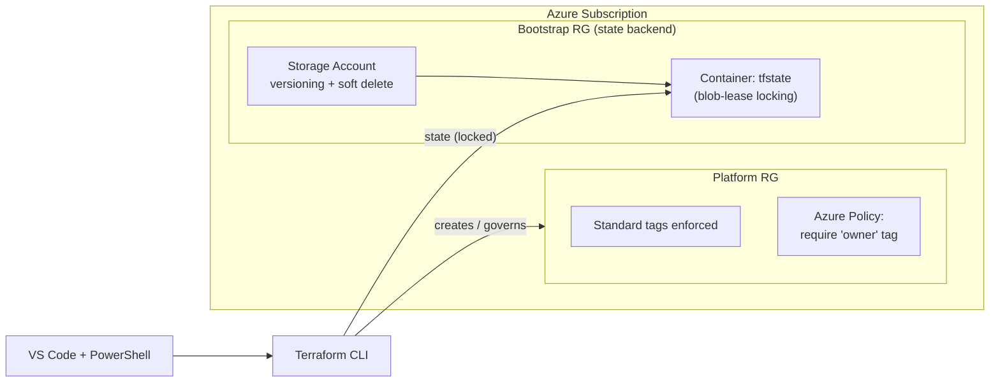

# Lab 01 — Foundation: IaC Bootstrap, Remote State & Governance

**Status:** ✅ Complete

## Business Problem

Skyline's infrastructure was built by clicking around the Azure Portal — no source of truth, no way to reproduce environments, no consistent naming or cost tagging, and no safe way for more than one engineer to make changes. Before building any application resources, the platform needed a governed foundation: a shared, locked place to store Terraform state; enforced naming and tagging standards; and baseline governance.

## What I Built

A Terraform-managed foundation with a secure remote state backend, a reusable naming/tagging module, the platform resource group, and an Azure Policy that enforces a required tag.



## How It Works

1. **`bootstrap/bootstrap.ps1`** imperatively creates the resource group, storage account, and blob container that will hold Terraform state — solving the chicken-and-egg problem (Terraform can't create its own state backend before the backend exists). The storage account is hardened with blob versioning, soft delete, TLS 1.2, no public blob access, and Entra-based auth.
2. **`environments/dev/backend.tf`** points Terraform at that backend and names the state file (`dev.terraform.tfstate`).
3. **`modules/naming/`** centralizes the naming pattern (`<type>-skyline-dev-eus2`) and a standard tag map, so every resource is consistent and a future standard change is a one-file edit.
4. **`environments/dev/main.tf`** creates the platform resource group with standard tags and assigns the built-in "Require a tag on resources" Azure Policy.

## Key Design Decisions

Documented in full as ADRs:

- **Remote state in Azure Storage** rather than Terraform Cloud — native, free-ish, stays in-tenant, and the default expectation on Azure teams. ([ADR-0001](adr/0001-remote-state-in-azure-storage.md))
- **Entra ID / RBAC data-plane auth** with shared keys and public blob access disabled — long-lived storage keys are a top breach vector. ([ADR-0002](adr/0002-rbac-over-storage-keys.md))
- **Imperative bootstrap** for the state backend, accepting that it lives outside Terraform to avoid a recursive bootstrapping problem. ([ADR-0003](adr/0003-imperative-bootstrap.md))
- **State locking via blob lease** — built into the azurerm backend, no separate lock table needed (unlike AWS S3 + DynamoDB).
- **Naming module over inline names** — prevents drift, guarantees consistent tags for cost reporting and policy compliance.
- **Audit-first policy scoped to the resource group** — staged governance rollout rather than an org-wide `Deny` on day one.

## Troubleshooting Log

Real issues encountered and how they were resolved — the debugging is as valuable as the build.

| Issue | Root Cause | Resolution |
|-------|-----------|------------|
| `403 AuthorizationPermissionMismatch` on `terraform init` | The backend uses Entra auth (`use_azuread_auth = true`), and my identity had no **data-plane** blob access. Owner/Contributor on the RG only covers the **control plane**. | Assigned the `Storage Blob Data Contributor` role on the storage account, waited for RBAC propagation, re-ran init. |
| `Invalid single-argument block definition` on `terraform init` | Two arguments (`type` and `default`) on one line in `variables.tf` — not allowed in Terraform's single-line block syntax. | Expanded each variable to a multi-line block; ran `terraform fmt`. |
| `az consumption budget create` failed (400 / preview) | The `consumption` CLI command group is in preview and broken for this subscription type. | Set the budget in the Portal instead — identical result, reliable path. |
| Policy assignment "still creating" for ~90s | Normal Azure Policy provisioning time, not a hang. | Confirmed via Activity Log; no action needed. |

**Biggest takeaway:** the 403 made the **control plane vs data plane** distinction concrete — being able to *create* a storage account (control plane) does not grant the right to *read/write its blobs* (data plane). These are separate RBAC layers, and the "error" was the security model working as intended.

## Verification

```powershell
# Resource group exists with all tags
az group show --name "rg-skyline-dev-eus2" --query "{name:name, tags:tags}" -o yaml

# State is tracked in the remote backend
terraform state list
```

## What's Next

Lab 02 builds on this foundation (same backend, same naming module) to deploy the application platform: App Service, Azure SQL, and Key Vault with managed-identity authentication.
