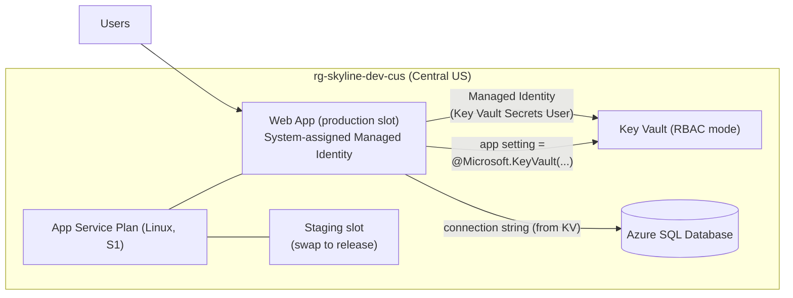

# Lab 02 — Web Platform: App Service, Azure SQL, Key Vault & Managed Identity

**Status:** ✅ Complete

## Business Problem

Skyline needed to host its customer-facing web application and a managed relational database — without the team managing virtual machines, OS patching, or scaling scripts. Equally important: the database credentials could not live in code or in plaintext application settings. The application had to authenticate to other Azure services with no stored password at all.

## What I Built

A Platform-as-a-Service stack on top of the Lab 01 foundation: an **App Service (Linux)** for the app, an **Azure SQL Database** for data, a **Key Vault** for secrets, a **system-assigned managed identity** so the app reads its secret with no stored credential, and a **staging deployment slot** for zero-downtime releases. Everything was added to the same `environments/dev` Terraform configuration and state used in Lab 01.

## How It Works

1. **App Service Plan + Linux Web App** host the application as PaaS — no VM management.
2. The web app has a **system-assigned managed identity** (Azure manages the credential lifecycle).
3. **Key Vault** (RBAC authorization mode) stores the SQL connection string as a secret.
4. The app's managed identity is granted the **Key Vault Secrets User** role, and an app setting uses a **Key Vault reference** (`@Microsoft.KeyVault(SecretUri=...)`) so App Service resolves the secret at runtime. The secret never appears in code or plaintext config.
5. A **staging deployment slot** enables zero-downtime releases via slot swap.

## Verification

| Evidence | Screenshot |
|----------|-----------|
| Full resource set in Terraform state (incl. slot) | `images/lab-02/terraform-state-list.png` |
| Resources deployed in Central US | `images/lab-02/resource-group-overview.png` |
| App Service running (S1, Linux) | `images/lab-02/app-service-overview.png` |
| System-assigned managed identity = On | `images/lab-02/managed-identity-on.png` |
| **Key Vault reference resolved (green check)** | `images/lab-02/kv-reference-resolved.png` |
| Secret present in Key Vault | `images/lab-02/keyvault-secret.png` |
| Deployment slots (production + staging) | `images/lab-02/deployment-slots.png` |
| Slot swap executed successfully | `images/lab-02/slot-swap.png` |

The resolved Key Vault reference (source shown as **Key Vault** with a green check) is the key proof: the application reads its database connection string via managed identity, with no credential stored in configuration.

## Key Design Decisions

Documented in full as ADRs:

- **App Service (PaaS) over AKS / Container Apps / VMs** — highest abstraction that fits a single web app; least operational overhead. ([ADR-0004](adr/0004-app-service-over-containers.md))
- **Managed identity + Key Vault references over secrets in config** — no credential is ever stored in code, config, or handled by a human; rotation requires no redeploy. ([ADR-0005](adr/0005-managed-identity-key-vault-references.md))
- **Migrated the lab to a Pay-As-You-Go subscription** after discovering the Visual Studio Enterprise subscription restricted App Service and SQL provisioning. ([ADR-0006](adr/0006-payg-subscription-for-labs.md))
- **Key Vault RBAC mode over access policies** — consistent with the rest of Azure RBAC, inheritable, Microsoft-recommended.
- **System-assigned managed identity over user-assigned** — lifecycle tied to the app for this 1:1 case.
- **S1 (Standard) over B1 (Basic)** — deployment slots require Standard+; accepted the higher tier cost to enable zero-downtime releases.

## Troubleshooting Log

This lab surfaced an unusually rich set of real-world issues. Each is captured as *symptom → cause → fix*.

| Issue | Root Cause | Resolution |
|-------|-----------|------------|
| `Duplicate resource "azurerm_linux_web_app"` | Pasted the Step 4 example block whole instead of merging its two lines into the existing Step 1 block. | Deleted the duplicate; merged the Key Vault reference and `depends_on` into the original block. |
| Edits not taking effect (duplicate persisted; SKU still showed B1) | File not saved — Terraform reads from disk, not the editor buffer. | Save before running any `terraform` command. (Enabled VS Code auto-save.) |
| `Missing required provider hashicorp/random` | Added a new provider (`random_password`) not yet downloaded. | `terraform init` to install the new provider. Re-running init is required whenever a new provider is added. |
| Deprecation warning: `enable_rbac_authorization` | Argument renamed to `rbac_authorization_enabled` (removed in azurerm v5). | Renamed to the supported form to stay forward-compatible. |
| App Service `401 Unauthorized — Total VMs: 0` and SQL `ProvisioningDisabled` in eastus2/eastus | **Visual Studio Enterprise subscription** restricts App Service to Premium-tier quota only and disables SQL provisioning across regions. | Diagnosed via the Usage + quotas blade as a subscription-tier restriction, not a code defect. Migrated to a dedicated Pay-As-You-Go subscription. |
| New PAYG subscription: `SubscriptionNotFound` despite `state: Enabled` | Brand-new subscriptions are eventually-consistent across the resource-management plane; first operations can fail before propagation completes. | Confirmed via a manual `az group create` that it was propagation lag; resolved by waiting a few minutes. |
| `SubscriptionNotFound` on storage/SQL ops while resource-group creation succeeded | Resource providers (Microsoft.Storage, Web, Sql, KeyVault, Network) were not yet registered on the fresh subscription. | `az provider register` for each, confirmed `Registered` via `az provider show`. |
| `403 AuthorizationPermissionMismatch` on `terraform init` (new backend) | The new PAYG state storage account had no data-plane RBAC role for my identity — same control-plane vs data-plane split as Lab 01. | Assigned `Storage Blob Data Contributor` on the new storage account; waited for propagation. |
| App Service `401 — Total VMs: 0` again, in eastus, on PAYG | New PAYG subscriptions receive **region-specific default quota** — eastus had 0 vCPU, while centralus had 10 (incl. BS family). | Relocated deployment region to Central US via the `location` variable + naming-module map. |
| Staging slot blocked: `RequestDisallowedByPolicy: require-owner-tag` | The Lab 01 Azure Policy correctly denied the slot because the slot resource had no tags. | Added `tags = module.naming.tags` to the slot. **The governance guardrail worked as designed — it caught a resource I forgot to tag.** |

**Standout lessons:**
- **Subscription tier matters.** Visual Studio Enterprise subscriptions are deliberately restricted for App Service and SQL; PAYG removes those limits. Diagnosing this from the quota blade (rather than fighting region whack-a-mole) was the key insight.
- **The IaC was fully portable across subscriptions.** Migrating the entire platform to a new subscription required changing only one environment variable (`ARM_SUBSCRIPTION_ID`) and one backend value — no resource definitions changed. This validated the decision in Lab 01 to keep the subscription ID out of code.
- **New subscriptions need warm-up:** propagation lag, resource provider registration, and region-specific default quotas are all normal first-deployment hurdles.
- **My own Lab 01 policy enforced tagging on a resource I added later** — proof the governance is real, not decorative.

## Documented Tech Debt (to address in later labs)

- **SQL public access is enabled** with an `AllowAzureServices` firewall rule — intentional, to be replaced by Private Endpoints in Lab 03.
- **Key Vault name is hardcoded** as `kv-skyline-dev-eus2` instead of using the naming module, so it carries an `eus2` suffix despite living in Central US. To be corrected to `kv-${module.naming.base}`.

## What's Next

Lab 03 pays down the networking debt: a VNet, Private Endpoints for SQL and Key Vault, Private DNS, and disabling public access on the data tier.
