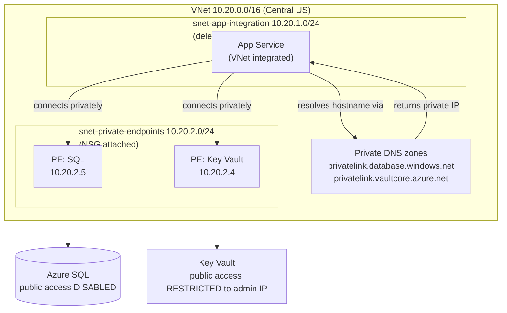

# Lab 03 — Secure Networking: VNet, Private Endpoints & Private DNS

**Status:** ✅ Complete

## Business Problem

By the end of Lab 02, Skyline's app worked — but its database and secrets were reachable over the public internet (protected by TLS and firewall rules, but still traversing the public network). For a platform handling customer data, that's a compliance and security gap: the data tier should never be exposed to the internet at all. The goal of Lab 03 was to make SQL and Key Vault reachable **only** from inside a private network, so their traffic never touches the public internet — and to pay down the public-access tech debt explicitly documented in Lab 02.

## What I Built

A private network topology layered onto the existing platform: a **Virtual Network** with two purpose-built subnets, **App Service VNet integration** for private outbound traffic, **Private Endpoints** giving SQL and Key Vault private IPs inside the VNet, **Private DNS zones** so the service hostnames resolve to those private IPs, **public access disabled/restricted** on the data tier, and an **NSG** as a defense-in-depth guardrail.

## How It Works

A request from the app to SQL now travels entirely over the Azure private network:

1. The App Service is **VNet-integrated** (`virtual_network_subnet_id` + `vnet_route_all_enabled = true`), so its outbound traffic originates from inside `snet-app-integration`.
2. The app resolves the normal hostname `sql-skyline-dev-cus.database.windows.net`.
3. The **private DNS zone** (`privatelink.database.windows.net`), linked to the VNet, answers with the **private IP** `10.20.2.5` instead of the public IP. Anything outside the VNet asking the same hostname still gets the public IP — same name, different answer depending on where you ask.
4. The app connects to the **private endpoint** at `10.20.2.5`, which forwards to the real SQL server over Azure's private backbone.
5. Because **public network access is disabled** on SQL, the only working path *is* the private one.

Key Vault works identically (private IP `10.20.2.4` via `privatelink.vaultcore.azure.net`), with one difference noted below.

## Verification

| Evidence | Screenshot |
|----------|-----------|
| VNet with two subnets (one delegated to Microsoft.Web) | `images/lab-03/vnet-subnets.png` |
| SQL private endpoint DNS config (10.20.2.5) | `images/lab-03/pe-sql-dns.png` |
| Key Vault private endpoint DNS config (10.20.2.4) | `images/lab-03/pe-keyvault-dns.png` |
| SQL public access disabled (Portal) | `images/lab-03/sql-public-access-disabled.png` |
| Key Vault restricted to admin IP (Portal) | `images/lab-03/keyvault-network-restricted.png` |
| NSG on private-endpoints subnet | `images/lab-03/nsg-rules.png` |
| Public access disabled (CLI verification) | `images/lab-03/public-access-disabled-cli.png` |
| Full resource set in Terraform state | `images/lab-03/terraform-state-list.png` |

The two networking states are deliberately different and worth comparing: **SQL shows "Disable"** (no public endpoint at all), while **Key Vault shows "Allow public access from specific networks and IP addresses"** with the admin IP — see the Design Decisions for why.

## SQL vs. Key Vault — two different lockdown states

This is the most important nuance in the lab:

| Resource | Public access state | Why |
|----------|--------------------|-----|
| **SQL** | Fully disabled | Terraform only does **control-plane** operations on SQL (provisions it via ARM; the password is generated locally and tracked in state). It never reads SQL's data plane, so full lockdown doesn't block Terraform. |
| **Key Vault** | Public endpoint kept, restricted to the admin IP via network ACL | Terraform performs a **data-plane** read of the secret on every plan/refresh. With the runner (my laptop) outside the VNet, full lockdown returns 403. Restricting to the admin IP keeps the public endpoint usable from one trusted address while denying everything else. |

The clean fix for Key Vault — full lockdown with no public endpoint — requires the Terraform runner to be **inside the VNet**, which Lab 04's CI/CD pipeline provides.

## Key Design Decisions

Documented as ADRs:

- **Private Endpoints over Service Endpoints** for the data tier. ([ADR-0007](adr/0007-private-endpoints-over-service-endpoints.md))
- **Regional VNet integration over an App Service Environment (ASE)** for connecting the app. ([ADR-0008](adr/0008-regional-vnet-integration-over-ase.md))
- **Private DNS is mandatory, not optional** — the private endpoint is useless without it. ([ADR-0009](adr/0009-private-dns-is-mandatory.md))
- **Two separate subnets** — App Service integration requires a delegated subnet; private endpoints require an undelegated one. Their requirements conflict, so they can't share.
- **Network ACL (deny + IP allowlist) for Key Vault instead of full public-access-disable** — chosen so the laptop-based Terraform runner can still perform data-plane secret reads; to be tightened to full lockdown once CI runs inside the VNet (Lab 04).

## Troubleshooting Log

| Issue | Root Cause | Resolution |
|-------|-----------|------------|
| `403 RequestDisallowedByPolicy` on DNS zone VNet links | The Lab 01 require-owner-tag policy denied the link resources because they lacked tags. | Added `tags = module.naming.tags` to both `azurerm_private_dns_zone_virtual_network_link` blocks. (Same policy guardrail that caught the Lab 02 slot — now an established habit.) |
| `403 ForbiddenByConnection` on Key Vault secret during `terraform plan`/`apply` | After setting `public_network_access_enabled = false`, Terraform's data-plane secret refresh (run from the laptop, outside the VNet) was blocked. | Switched from full public-access-disable to a network ACL: `default_action = "Deny"` + `ip_rules = ["<admin-ip>/32"]`. |
| `public_network_access_enabled = false` **and** `ip_rules` set, but laptop still blocked | The two settings are mutually exclusive: `public_network_access_enabled = false` removes the public endpoint entirely, so `ip_rules` are ignored. | Removed `public_network_access_enabled = false`; relied solely on `network_acls` (deny by default + admin IP allowlist). |
| Chicken-and-egg: couldn't `plan` to apply the IP rule, because `plan` reads the secret which the missing IP rule blocks | The refresh of the existing secret happens before the IP-rule change is applied. | Applied the Key Vault change in isolation first: `terraform apply -target azurerm_key_vault.main`, then ran the full apply. |
| `terraform apply -target=...` failed in PowerShell | PowerShell argument parsing dislikes the `=` form for this flag. | Use the space form: `terraform apply -target azurerm_key_vault.main`. |

**Standout lessons:**
- **Private DNS is the piece that makes a private endpoint actually used.** A private endpoint with a private IP but no DNS wiring is a bridge to nowhere — the app keeps resolving the public IP. Verifying the A record in the private zone is the real proof of success.
- **Control-plane vs data-plane, applied to networking:** SQL could be fully locked down because Terraform never touches its data plane; Key Vault could not, because Terraform reads the secret on every refresh. The same concept that explained the Lab 01 state-backend 403 explains why these two resources end up in different network states.
- **`public_network_access_enabled = false` vs `network_acls` deny+allowlist are different tools** — the former kills the public endpoint, the latter restricts it. Using both means the stricter one wins and the IP rules are silently ignored.
- **`-target` is a legitimate break-glass tool** for dependency loops like the IP-rule/secret-read chicken-and-egg — used deliberately, not as a habit.

## Documented Tech Debt (carried forward)

- **Key Vault is not yet fully locked down** — it keeps a public endpoint restricted to the admin IP, because the Terraform runner is outside the VNet. Lab 04 (CI/CD from inside the VNet) is the prerequisite for setting `public_network_access_enabled = false` on Key Vault.
- **Admin IP is hardcoded** in the Key Vault `ip_rules`. A home/office IP can change; a more robust approach is a variable or a CI runner inside the VNet.
- **Key Vault name still carries the `eus2` suffix** (`kv-skyline-dev-eus2`) despite living in Central US — carried from Lab 02; to be corrected post-Lab-05.

## What's Next

Lab 04 introduces CI/CD with GitHub Actions and OIDC, running Terraform from inside the network — which also enables fully locking down Key Vault's public endpoint.
